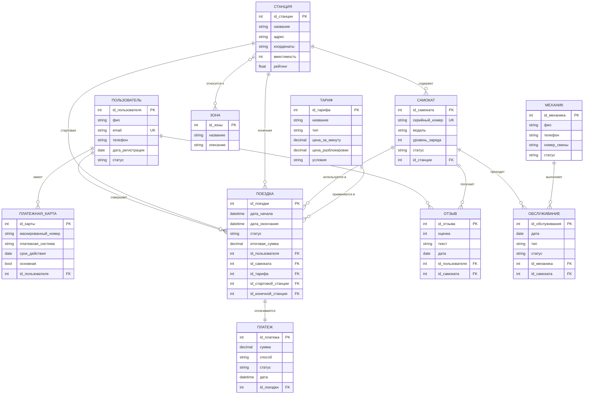
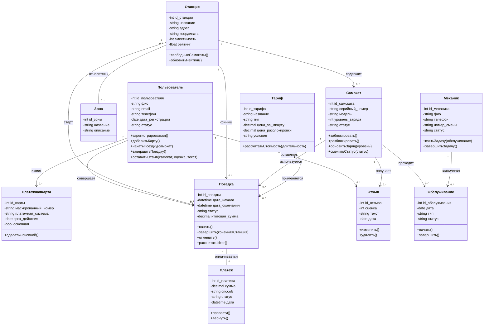
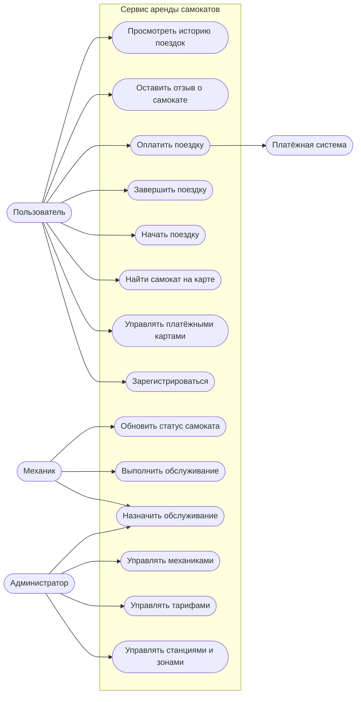
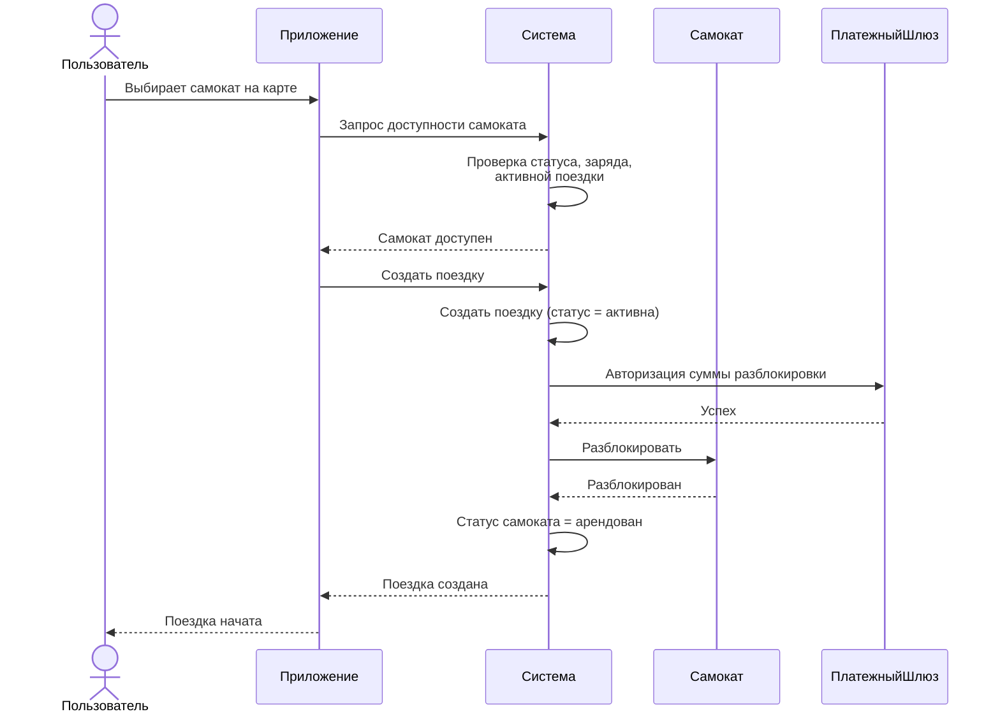
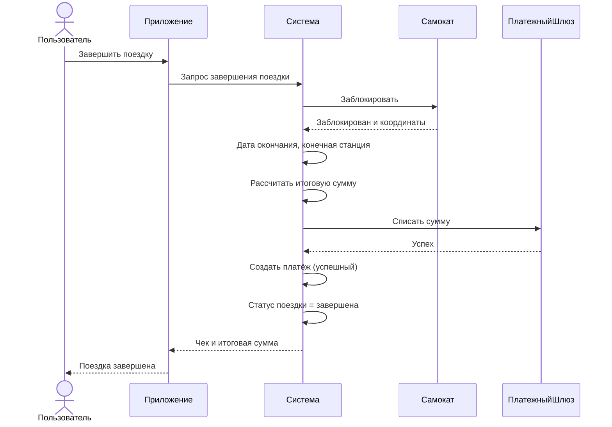
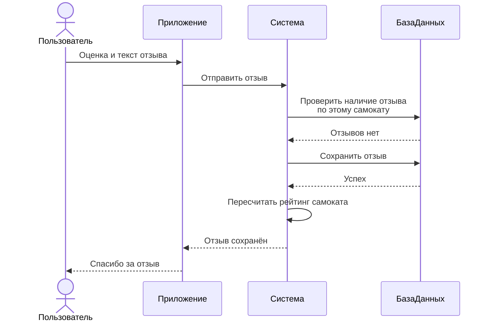
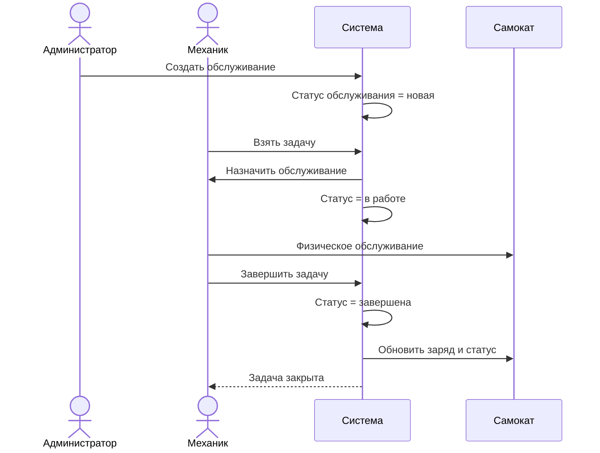

# Сервис аренды электросамокатов — модели

## 1. ER-модель

## 2. UML-диаграмма классов

## 3. UML-диаграмма вариантов использования

## 4. Диаграмма последовательностей «Начало поездки»

## 5. Диаграмма последовательностей «Завершение поездки и оплата»

## 6. Диаграмма последовательностей «Оставление отзыва»

## 7. Диаграмма последовательностей «Обслуживание самоката механиком»

